## 使用CocosCreator 3.0制作《合成大西瓜》
Author: MoriMiya

### 需求分析

#### 场景
1. 一个不让水果跑到界面外的场景。
2. 场景能显示分数。
3. 场景具有警戒线，有水果超过警戒线则表示游戏失败。

#### 水果
1. 支持水果按类型在指定位置生成，以方便生成下一个水果及合成的水果。
2. 水果间不可重叠，需要使用2D物理。
3. 水果合成需要有合成特效及分数加成。

### 资源准备
1. 在资源管理器中创建Images文件夹，将游戏所需要用到的贴图素材放进去，再将贴图素材Type改为sprite-frame。
2. 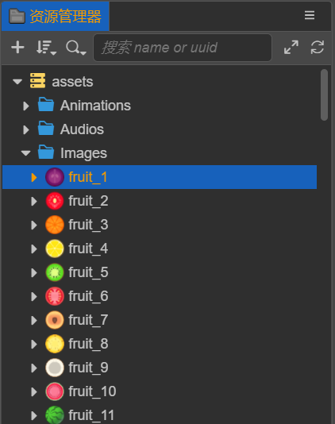

### 场景设置
1. 在项目设置中配置设计宽度和设计高度，设置为640X960，勾选适配屏幕宽度。
    - 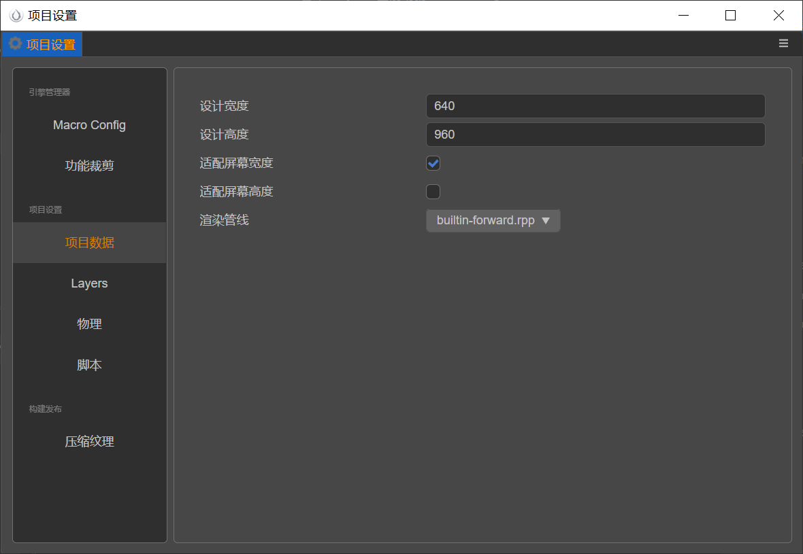
2. 在资源管理器中创建Scenes文件夹，在下面创建一个Main场景，作为游戏主场景。
3. 双击进入Main场景，删除自带的Main Camera和Main Light。
4. 创建一个名为BG的单色Sprite，作为游戏背景。
5. 在背景BG左边、右边、下边创建单色Sprite，在其中加入RigidBody2D和BoxCollider2D，RigidBody2D的Type设置为Static，以避免其受重力影响而下坠。
    - 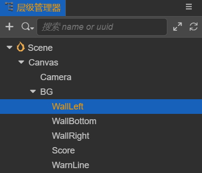
    - 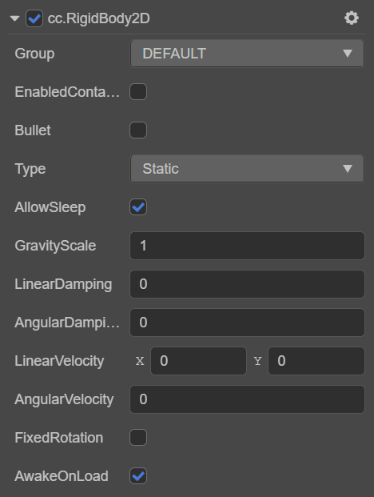
    - 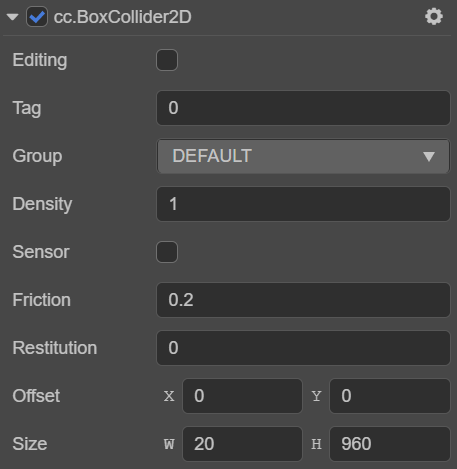
6. 在左上角及上方添加分数Score和WarnLine的Label。
7. 在资源管理器中创建Scripts文件夹，创建GameManager.ts脚本。
8. 给Canvas添加GameManager脚本组件，将Score和WarnLine两个Label作为脚本的property。
    - 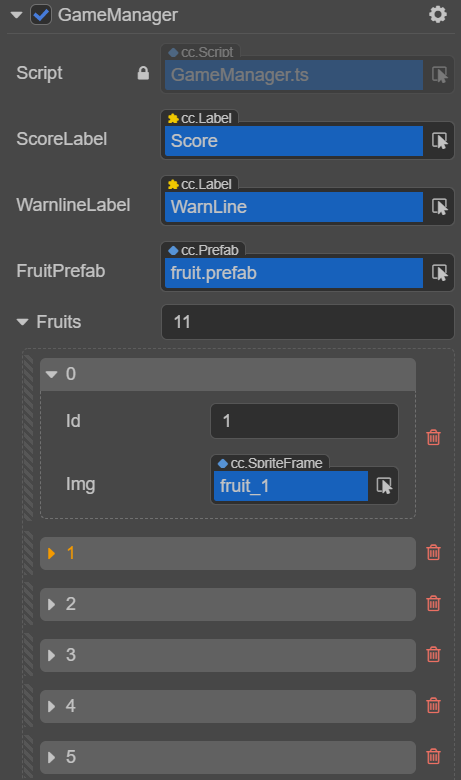
9. 至此，场景便完成布置了。
    - 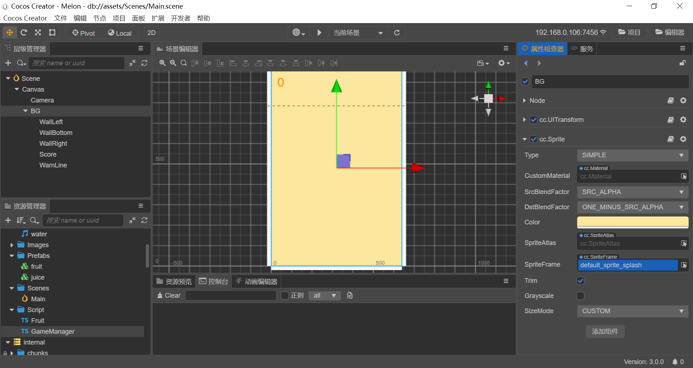

### 水果生成
1. 创建一个名为fruit的Sprite，将SpriteFrame替换为fruit_1。

2. 添加RigidBody2D和CircleCollider2D。

    - 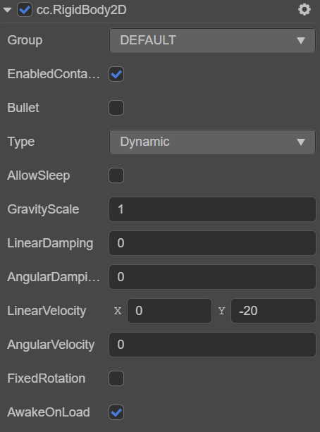

    - 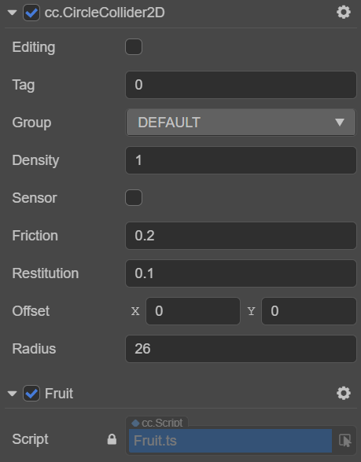

3. 在Script文件夹里面创建Fruit.ts脚本。将该脚本设置为水果的脚本组件。

4. 创建Prefabs文件夹，将fruit拖到Prefabs文件夹中，让fruit成为预制体并将该预制体设置为GameManager.ts的property，方便后续程序动态生成水果。

5. 给GameManager创建一个带有水果编号ID和水果SpriteFrame的数组property，在编辑器中逐个编辑好内容。

### 水果合成特效
1. 创建一个名为juice的Sprite，将SpriteFrame替换为juice_l_1。
2. 给该sprite添加两个ParticleSystem2D子节点，分别命名为sarcocarp和dewdrop，分别作为果粒和水珠的爆炸特效。
    - 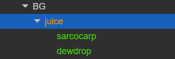
3. 调好sarcocarp和dewdrop的粒子参数，调到自己满意即可。
    - 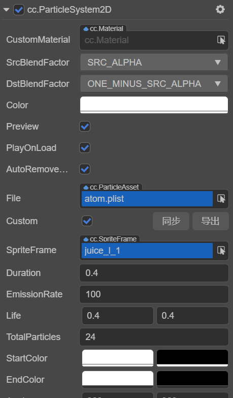
4. 将juice拖到Prefabs文件夹中，让juice成为预制体并将该预制体设置为GameManager.ts的property，方便后续程序动态生成水果合成特效。
5. 给GameManager创建一个带有水果果粒、水珠、水花SpriteFrame的数组property，在编辑器中逐个编辑好内容。
6. 给GameManager.ts添加两个AudioClip，放进合成使用的音效，给Canvas添加AudioSource，用于后续脚本播放音效使用。

### 游戏逻辑
1. 至此，游戏准备工作都完成了，剩下的便是游戏脚本逻辑，这里直接上最终代码。
```ts
// fruit.ts
import { _decorator, Component, Node, Sprite, Collider2D, Contact2DType } from 'cc';
import {FruitItem} from "./GameManager"
const { ccclass, property } = _decorator;

@ccclass('Fruit')
export class Fruit extends Component {

    private id: number = 0;

    init (data: FruitItem) {
        this.id = data.id;
        let sprite = this.node.getComponent(Sprite);
        if (sprite) {
            sprite.spriteFrame = data.img;
        }
    }

    getID() {
        return this.id;
    }

    onBeginContact (selfCollider: Collider2D, otherCollider: Collider2D, contact: any) {
        // 只在两个碰撞体开始接触时被调用一次
        if (selfCollider.node && otherCollider.node) {
            const s = selfCollider.node.getComponent(Fruit);
            const o = otherCollider.node.getComponent(Fruit);
            if (s && o) {
                if (s.id === o.id) {
                    console.log("emit sameContact");
                    selfCollider.node.emit('sameContact', selfCollider, otherCollider);
                }
            }
        }
    }

    start () {
        let collider = this.getComponent(Collider2D);
        if (collider) {
            collider.on(Contact2DType.BEGIN_CONTACT, this.onBeginContact, this);
        }
    }
}
```

```ts
// GameManager.ts
import { _decorator, Component, Node, CCClass, SpriteFrame, CCInteger, instantiate, Prefab, CircleCollider2D, Vec3, log, EventTouch, Vec2, director, PhysicsSystem2D, EPhysics2DDrawFlags, PHYSICS_2D_PTM_RATIO, UITransform, utils, tween, RigidBody2D, ERigidBody2DType, Collider2D, Sprite, math, ParticleSystem2D, AudioClip, AudioSource, Label, spriteAssembler } from 'cc';
import { Fruit } from "./Fruit"
const { ccclass, property } = _decorator;

@ccclass("FruitItem")
export class FruitItem {
    @property({type: CCInteger})
	public id: number = 1;
    @property({type: SpriteFrame})
    public img: SpriteFrame = null!;
}

@ccclass("JuiceItem")
class JuiceItem {
    @property({type: SpriteFrame})
    public juiceSF: SpriteFrame = null!;
    @property({type: SpriteFrame})
    public sarcocarpSF: SpriteFrame = null!;
    @property({type: SpriteFrame})
    public dewdropSF: SpriteFrame = null!;
}

@ccclass('GameManager')
export class GameManager extends Component {

    @property({type: Label})
    public scoreLabel: Label = null!;
    @property({type: Label})
    public warnlineLabel: Label = null!;

    @property({type: Prefab})
    public fruitPrefab: Prefab = null!;
    @property({type: FruitItem})
	public fruits: FruitItem[] = [];

    @property({type: Prefab})
    public juicePrefab: Prefab = null!;
    @property({type: JuiceItem})
	public juices: JuiceItem[] = [];

    @property({type: AudioClip})
	public boomAudio: AudioClip = null!;
    @property({type: AudioClip})
	public waterAudio: AudioClip = null!;

    private curFruit: any = null;
    private curWarnlineFruit: any = null;
    private lastWarnlineFruitPos: Vec3 = new Vec3(0, 0, 0);
    private warnlineFruitLastTime: number = 0;

    private isCreating: boolean = false;
    private isMoving: boolean = false;
    private score: number = 0;

    private combineList: any[] = [];

    onLoad() {
        this.initPhysics()

        this.isCreating = false;
        this.isMoving = false;
        this.score = 0;

        this.node.on(Node.EventType.TOUCH_START, this.onTouchStart, this);
        this.node.on(Node.EventType.TOUCH_MOVE, this.onTouchMove, this);
        this.node.on(Node.EventType.TOUCH_END, this.onTouchEnd, this);

        this.initOneFruit()
    }

    start () {
        log("Start");
    }

    initPhysics() {
        const system = PhysicsSystem2D.instance;
        system.debugDrawFlags = EPhysics2DDrawFlags.Aabb |
                                                EPhysics2DDrawFlags.Pair |
                                                EPhysics2DDrawFlags.CenterOfMass |
                                                EPhysics2DDrawFlags.Joint |
                                                EPhysics2DDrawFlags.Shape;
        
        system.gravity = new Vec2(0, -20 * PHYSICS_2D_PTM_RATIO);

        // 物理步长，默认 fixedTimeStep 是 1/60
        system.fixedTimeStep = 1/60;
        // 每次更新物理系统处理速度的迭代次数，默认为 10
        system.velocityIterations = 8;
        // 每次更新物理系统处理位置的迭代次数，默认为 10
        system.positionIterations = 8;
    }

    initOneFruit() {
        this.curFruit = this.createOneFruit(0, 400, 1);
    }

    getNextFruitId() {
        // return 2;
        return Math.floor(Math.random() * 5) + 1
    }

    createOneFruit(x: number, y: number, iFruitID: number) {
        let oFruit = instantiate(this.fruitPrefab);
        const config = this.fruits[iFruitID - 1];
        
        let fruitComponent = oFruit.getComponent(Fruit);
        if (fruitComponent) {
            fruitComponent.init({
                id: config.id,
                img: config.img
            });
        }
        
        let rigidBody2D = oFruit.getComponent(RigidBody2D);
        if (rigidBody2D)
            rigidBody2D.type = ERigidBody2DType.Static;

        let collider2D = oFruit.getComponent(CircleCollider2D);
        if (collider2D) {
            collider2D.enabled = false;
            collider2D.apply();
        }
        
        oFruit.setPosition(new Vec3(x, y, 0));
        this.node.addChild(oFruit);

        oFruit.on('sameContact', this.onSameContact, this);

        return oFruit;
    }

    enablePhysics(oFruit: Node) {
        let rigidBody2D = oFruit.getComponent(RigidBody2D);
        if (rigidBody2D)
            rigidBody2D.type = ERigidBody2DType.Dynamic;
        
        let collider2D = oFruit.getComponent(CircleCollider2D);
        if (collider2D) {
            collider2D.enabled = true;
            let uiTransform = oFruit.getComponent(UITransform);
            if (uiTransform) {
                collider2D.radius = uiTransform.contentSize.width / 2;
                collider2D.apply();
            }
        }
    }

    enableFruitContactWarnline(oFruit: Node) {
        oFruit.on('warnlineContact', this.onSameContact, this);
    }

    showJuice(x: number, y: number, iFruitID: number) {
        let oJuice = instantiate(this.juicePrefab);
        oJuice.setPosition(new Vec3(x, y, 0));
        const config = this.juices[iFruitID - 1];
        let sprite = oJuice.getComponent(Sprite);
        oJuice.setScale(new Vec3(0.4 * Math.pow(1.2, iFruitID - 1), 0.4 * Math.pow(1.2, iFruitID - 1), 1));
        if (sprite) {
            sprite.spriteFrame = config.juiceSF;
        }
        let sarcocarp = oJuice.getChildByName("sarcocarp");
        if (sarcocarp) {
            let particle2D = sarcocarp.getComponent(ParticleSystem2D);
            if (particle2D) {
                particle2D.spriteFrame = config.sarcocarpSF;
                particle2D.startSize = 20 * Math.pow(1.2, iFruitID - 1);
                particle2D.endSize = 2 * Math.pow(1.2, iFruitID - 1);
            }
        }
        let dewdrop = oJuice.getChildByName("dewdrop");
        if (dewdrop) {
            let particle2D = dewdrop.getComponent(ParticleSystem2D);
            if (particle2D) {
                particle2D.spriteFrame = config.dewdropSF;
                particle2D.startSize = 20 * Math.pow(1.2, iFruitID - 1);
                particle2D.endSize = 4 * Math.pow(1.2, iFruitID - 1);
            }
        }

        this.node.addChild(oJuice);

        this.scheduleOnce(() => {
            oJuice.destroy();
        }, 1);
    }

    addScore(iFruitID: number) {
        this.score += iFruitID;
        if (iFruitID === 10) {
            this.score += 100;
        }
        if (this.scoreLabel) {
            this.scoreLabel.string = '' + this.score;
        }
    }

    gameEnd() {
        this.node.children.forEach(element => {
            if (element.name == "fruit" && element != this.curFruit) {
                let pos = element.getPosition();
                let iFruitID = element.getComponent(Fruit)?.getID();
                if (iFruitID) {
                    element.active = false;
                    element.destroy();
                    this.addScore(iFruitID);
                    this.showJuice(pos.x, pos.y, iFruitID);
                }
            }
        });
        this.curWarnlineFruit = null;
    }

    onTouchStart(event: EventTouch) {
        if (this.isCreating)
            return;
        if (this.isMoving)
            return;
        this.isMoving = true;
        const pos = event.getUILocation();    // letf-bottom pos.
        let x = pos.x;
        let uiTransform = this.getComponent(UITransform);
        if (uiTransform) {
            x -= uiTransform.width / 2;
        }
        tween(this.curFruit)
            .to(0.1, {position: new Vec3(x, 400, 0)}, { easing: 'cubicIn', 'onComplete': (oFruit: any) => {
                this.isMoving = false;
            }})
            .start();
    }

    onTouchMove(event: EventTouch) {
        if (this.isCreating)
            return;
        if (this.isMoving)
            return;
        if (this.curFruit != null) {
            const pos = event.getUILocation();    // letf-bottom pos.
            let x = pos.x;
            let uiTransform = this.getComponent(UITransform);
            if (uiTransform) {
                x -= uiTransform.width / 2;
            }
            this.curFruit.setPosition(new Vec3(x, 400, 0));
        }
    }

    onTouchEnd(event: EventTouch) {
        if (this.isCreating)
            return;
        if (this.curFruit === null)
            return;
        tween(this.curFruit).stop();
        this.isMoving = false;
        
        const pos = event.getUILocation();    // letf-bottom pos.
        let x = pos.x;
        let uiTransform = this.getComponent(UITransform);
        if (uiTransform) {
            x -= uiTransform.width / 2;
        }
        this.curFruit.setPosition(new Vec3(x, 400, 0));
        this.enablePhysics(this.curFruit);
        this.curFruit = null;
        this.isCreating = true;
        this.scheduleOnce(() => {
            this.curFruit = this.createOneFruit(0, 400, this.getNextFruitId());
            this.isCreating = false;
        }, 0.6);
    }

    onSameContact(selfCollider: Collider2D, otherCollider: Collider2D) {
        console.log("---onSameContact");
        if ((selfCollider.node === this.curFruit) || (otherCollider.node == this.curFruit))
            return;
        let oSelfFruit = selfCollider.node.getComponent(Fruit);
        let iFruitID = 0;
        if (oSelfFruit)
            iFruitID = oSelfFruit.getID();
        if (iFruitID < 11) {
            this.combineList.push({
                nodeA: selfCollider.node,
                nodeB: otherCollider.node
            });
        }
    }

    lateUpdate(deltaTime: number) {
        this.combineList.forEach(element => {
            if (element.nodeA.isValid && element.nodeB.isValid && element.nodeA.active && element.nodeB.active) {
                let oSelfFruit = element.nodeA.getComponent(Fruit);
                let iFruitID = 0;
                if (oSelfFruit)
                    iFruitID = oSelfFruit.getID();
                
                const {x, y} = element.nodeB.getPosition();
                
                element.nodeA.active = false;
                element.nodeB.active = false;

                element.nodeA.destroy();
                element.nodeB.destroy();
        
                this.addScore(iFruitID);
        
                const nextId = iFruitID + 1;
                if (nextId <= 11) {
                    let oFruit = this.createOneFruit(x, y, nextId);
                    this.enablePhysics(oFruit);
                    this.showJuice(x, y - 6, iFruitID);
                    this.getComponent(AudioSource)?.playOneShot(this.waterAudio, 1);
                    this.getComponent(AudioSource)?.playOneShot(this.boomAudio, 0.2);
                    
                    oFruit.setScale(new Vec3(0.4, 0.4, 1));
                    tween(oFruit)
                        .to(0.5, {scale: new Vec3(1, 1, 1)}, { easing: 'backOut'})
                        .start();
                }
            }
        });
        if (this.combineList.length > 0) {
            this.combineList = [];
            this.curWarnlineFruit = null;
            this.warnlineFruitLastTime = 0;
        }
        else {
            let warnY = this.warnlineLabel.node.getPosition().y;
            if (this.curWarnlineFruit != null && this.curWarnlineFruit != this.curFruit) {
                let pos = this.curWarnlineFruit.getPosition().subtract(this.lastWarnlineFruitPos);
                if (pos.length() < 1) {
                    this.warnlineFruitLastTime += 1;
                    if (this.warnlineFruitLastTime > 90) {
                        this.gameEnd();
                    }
                }
                else {
                    this.curWarnlineFruit = null;
                    this.warnlineFruitLastTime = 0;
                }
            }
            else {
                this.curWarnlineFruit = null;
                this.warnlineFruitLastTime = 0;
                this.node.children.forEach(element => {
                    if (element.name == "fruit" && element != this.curFruit) {
                        let pos = element.getPosition();
                        let uiTransform = element.getComponent(UITransform);
                        if (uiTransform) {
                            const h = uiTransform.contentSize.height;
                            if (pos.y + (h / 2) > warnY) {
                                this.curWarnlineFruit = element;
                                this.lastWarnlineFruitPos = pos;
                            }
                        }
                    }
                });
            }
        }
    }
}
```